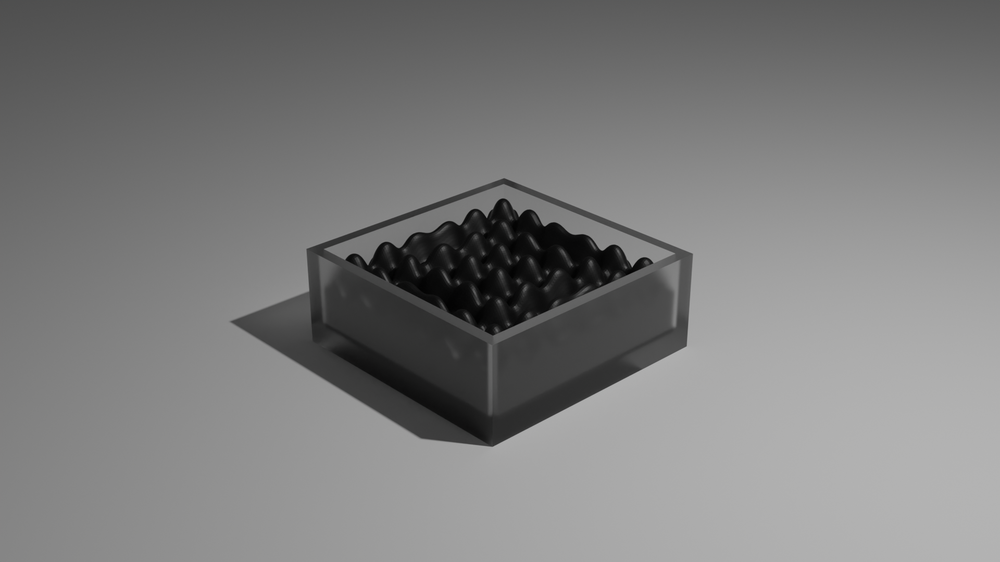

# LBM-Based Ferrofluid





### How to run the code

```bash
cd LBM-Ferrofluid
git submodule update --init --recursive
conda env create -f conda_env.yaml -n LBM_ferrofluid
conda activate LBM_ferrofluid
pip install -r requirements.txt
python setup.py build
```

### Trouble Shooting
 - If you have met a problem on windows that 'cl' cannot be found, go into your Visual Studio find it, and then add them into your environment path.